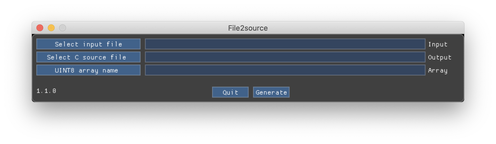

# file2source
A graphical tool to generate source code (C or Rust) from a file whatever the format, with specific options for RAW and PNG images.

An easy way to include binary data to your source code, if you want to distribute you app in a single file.
This tool can convert RGB RAW pictures to RGBA format with selection of alpha color.
It can also decode a PNG image and save it as `uint8` or `Vec<u8>` rgba data.

This repo is an exhumation of an old tool I wrote in my SDL / OpenGL / CodeBlocks / mingw learning and coding times.
At that time SDL transparency was handled by a mask, and then, when I switched to OpenGL, I needed a RGB -> RGBA conversion to convert my SDL bitmaps with a green back to more conventional RGBA bitmaps.

As of 1.0.1, the (very) old source has been relatively untouched, but reworked to be a little less ugly, and to be compiled with clang on Windows and Mac with the latest release of imgui.
It still has the same shitty code and ergonomy, but still does the job.

1.1.0 added the Rust and PNG features.

Dependency : the GLFW libs (3.3)

